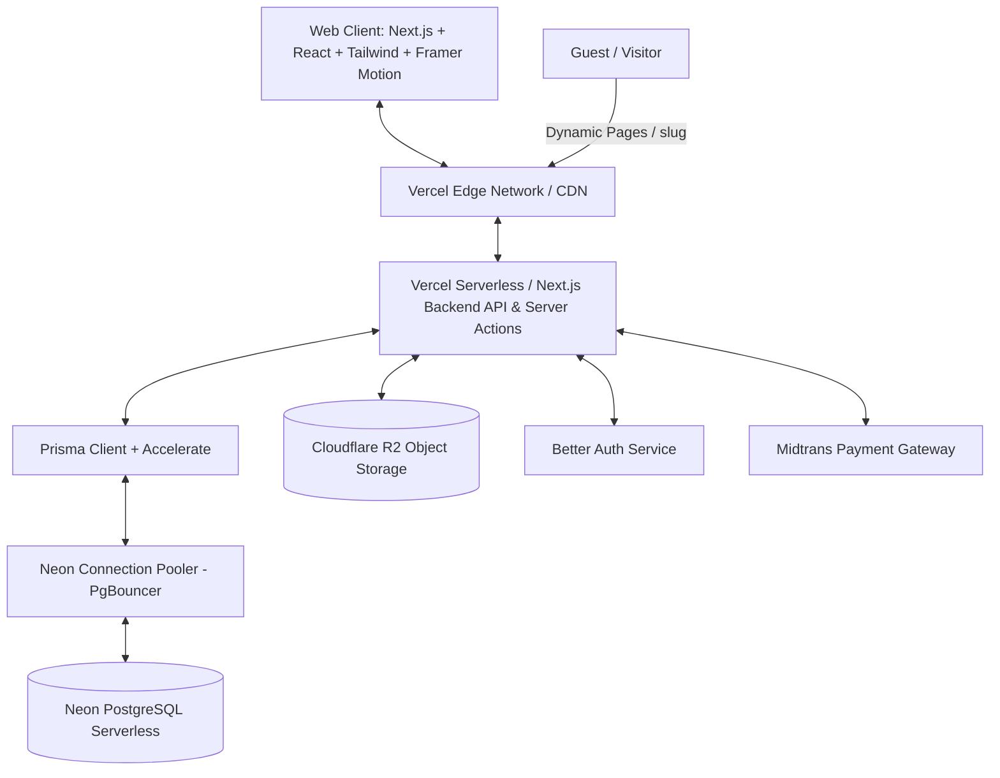
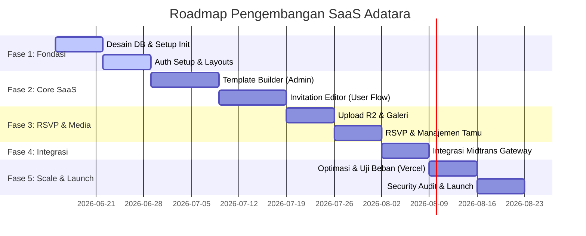

# Adatara – Platform SaaS Undangan Digital
## Arsitektur & Spesifikasi Implementasi Lengkap

Dokumen ini berisi cetak biru arsitektur, skema database, endpoint API, desain UI/UX, roadmap pengembangan, dan rekomendasi skalabilitas untuk membangun platform SaaS **Adatara** menggunakan **Next.js 15 (App Router)**, **PostgreSQL (Neon)**, **Prisma ORM**, **Cloudflare R2**, **Better Auth**, dan **Midtrans**.

---

## 1. Arsitektur Sistem Lengkap

Arsitektur Adatara dirancang menggunakan model **serverless modern** dengan pemisahan yang jelas antara frontend (UI), backend logic (Server Actions & API Routes), database, storage, dan layanan pihak ketiga (auth & payment).



### Penjelasan Komponen Arsitektur:
1. **Client Tier**: Dibangun menggunakan **Next.js 15 App Router** dengan **TypeScript**. Menggunakan **Tailwind CSS** dan **Shadcn UI** untuk UI premium, serta **Framer Motion** untuk efek transisi dan animasi visual undangan.
2. **Server Tier**: Serverless backend di **Vercel** yang menjalankan **Server Actions** untuk interaksi form yang aman dan efisien, serta **API Routes** untuk integrasi eksternal (seperti Webhooks Midtrans dan ekspor data).
3. **Database Tier**: **Neon PostgreSQL** serverless database. Prisma ORM bertindak sebagai perantara dengan memanfaatkan *connection pooling* bawaan Neon untuk mengatasi beban puncak koneksi.
4. **File Storage**: **Cloudflare R2** (S3-compatible object storage) digunakan untuk menyimpan aset media (gambar galeri, video cover, musik MP3) yang diunggah oleh Admin dan Pengguna.
5. **Authentication**: **Better Auth** mengelola registrasi, login, session management, dan role-based access control (Admin, User, Guest).
6. **Payment Gateway**: **Midtrans** untuk penanganan pembayaran invoice transaksi SaaS secara otomatis menggunakan *Snap API* dan webhooks untuk memutakhirkan status transaksi.

---

## 2. Struktur Folder Next.js

Berikut adalah struktur folder Next.js (App Router) yang direkomendasikan untuk modularitas, keterbacaan, dan skalabilitas:

```
adatara/
├── src/
│   ├── actions/                  # Next.js Server Actions (CRUD, Auth, Transaksi)
│   │   ├── admin/
│   │   ├── template/
│   │   ├── invitation/
│   │   └── payment/
│   ├── app/                      # Next.js App Router Pages
│   │   ├── (auth)/               # Route Group untuk Login & Register
│   │   │   ├── login/
│   │   │   └── register/
│   │   ├── (dashboard)/          # Route Group untuk Client Panel & Admin
│   │   │   ├── dashboard/        # User Dashboard (Kelola Undangan, RSVP, Tamu)
│   │   │   └── admin/            # Super Admin (Kelola Templates, Transaksi, Musik)
│   │   ├── (invitation)/         # Route Group untuk Public Invitations
│   │   │   └── u/[slug]/         # Halaman Undangan Publik (Dynamic Route)
│   │   ├── api/                  # API Routes (Webhooks, File Upload Signatures)
│   │   │   ├── webhook/midtrans/
│   │   │   └── upload/
│   │   ├── layout.tsx
│   │   └── page.tsx              # Landing Page & Template Gallery
│   ├── components/               # Reusable UI Components
│   │   ├── ui/                   # Shadcn UI primitives (Button, Dialog, dll.)
│   │   ├── builder/              # Drag & Drop Template Builder Components
│   │   │   ├── Sidebar.tsx
│   │   │   ├── Canvas.tsx
│   │   │   └── Preview.tsx
│   │   ├── dashboard/            # Dashboard widgets & layout components
│   │   └── invitation/           # Template sections (Cover, Opening, Profile, Event, Gallery, Closing)
│   ├── hooks/                    # Custom React Hooks
│   ├── lib/                      # Utilitas & Konfigurasi Eksternal
│   │   ├── db.ts                 # Prisma Client setup
│   │   ├── auth.ts               # Better Auth setup & configuration
│   │   ├── midtrans.ts           # Midtrans Node Client
│   │   └── s3.ts                 # Cloudflare R2 Client configuration
│   ├── types/                    # TypeScript Type Definitions
│   └── utils/                    # Helper functions (date formatters, JSON validators)
├── prisma/
│   ├── schema.prisma             # Skema Prisma DB
│   └── seed.ts                   # Seed Data untuk Templates, Musik, dan Admin
├── public/                       # Aset Statis (logo, default backgrounds)
├── package.json
├── tailwind.config.ts
└── tsconfig.json
```

---

## 3. Struktur Database & Prisma Schema Lengkap

Berikut adalah schema lengkap PostgreSQL yang ditulis dalam sintaks **Prisma Schema**. Schema ini mengintegrasikan seluruh entitas yang dibutuhkan (User, Template, Invitation, Music, Gallery, Guest, RSVP, Transaction) serta relasi dan indeks optimal.

```prisma
datasource db {
  provider = "postgresql"
  url      = env("DATABASE_URL")
}

generator client {
  provider = "prisma-client-js"
}

// ==========================================
// ENUMS
// ==========================================

enum Role {
  SUPER_ADMIN
  USER
}

enum UserStatus {
  ACTIVE
  SUSPENDED
}

enum TemplateStatus {
  DRAFT
  PUBLISHED
}

enum InvitationStatus {
  DRAFT
  ACTIVE
  INACTIVE
}

enum TransactionStatus {
  PENDING
  SUCCESS
  FAILED
  EXPIRED
}

// ==========================================
// MODELS
// ==========================================

model User {
  id           String        @id @default(uuid())
  nama         String
  email        String        @unique
  nomor_hp     String?
  password     String        // Untuk local credentials auth
  role         Role          @default(USER)
  status       UserStatus    @default(ACTIVE)
  created_at   DateTime      @default(now())
  updated_at   DateTime      @updatedAt

  invitations  Invitation[]
  transactions Transaction[]

  @@index([email])
}

model Template {
  id            String         @id @default(uuid())
  nama_template String
  kategori      String         // Kategori acara (Pernikahan, Ulang Tahun, dll.)
  thumbnail     String         // URL image thumbnail template
  deskripsi     String?
  template_json Json           // Menyimpan layout default & styling config
  status        TemplateStatus @default(DRAFT)
  created_at    DateTime       @default(now())
  updated_at    DateTime       @updatedAt

  invitations  Invitation[]

  @@index([kategori])
  @@index([status])
}

model Invitation {
  id                String           @id @default(uuid())
  user_id           String
  template_id       String
  slug              String           @unique // URL personal (contoh: adatara.id/u/aditya-tara)
  data_undangan_json Json             // Menyimpan modifikasi data acara, font, warna, dll.
  status            InvitationStatus @default(DRAFT)
  created_at        DateTime         @default(now())
  updated_at        DateTime         @updatedAt

  user              User             @relation(fields: [user_id], references: [id], onDelete: Cascade)
  template          Template         @relation(fields: [template_id], references: [id])
  galleries         Gallery[]
  guests            Guest[]
  rsvps             RSVP[]

  @@index([user_id])
  @@index([slug])
}

model MusicLibrary {
  id         String   @id @default(uuid())
  judul      String
  artis      String?
  audio_url  String   // File MP3 di Cloudflare R2
  durasi     Int?     // Durasi dalam detik
  created_at DateTime @default(now())
}

model Gallery {
  id            String     @id @default(uuid())
  invitation_id String
  image_url     String     // File gambar di Cloudflare R2
  urutan        Int        @default(0) // Urutan sorting galeri
  created_at    DateTime   @default(now())

  invitation    Invitation @relation(fields: [invitation_id], references: [id], onDelete: Cascade)

  @@index([invitation_id])
}

model Guest {
  id               String          @id @default(uuid())
  invitation_id    String
  nama             String
  nomor_hp         String?
  status_kehadiran String?         // PENDING, CONFIRMED, DECLINED (opsional sebelum RSVP diisi)
  created_at       DateTime        @default(now())

  invitation       Invitation      @relation(fields: [invitation_id], references: [id], onDelete: Cascade)
  rsvp             RSVP?

  @@index([invitation_id])
}

model RSVP {
  id            String     @id @default(uuid())
  invitation_id String
  guest_id      String     @unique // Satu tamu hanya bisa mengisi 1 RSVP
  kehadiran     Boolean    // true: Hadir, false: Tidak Hadir
  ucapan        String     @db.Text
  created_at    DateTime   @default(now())

  invitation    Invitation @relation(fields: [invitation_id], references: [id], onDelete: Cascade)
  guest         Guest      @relation(fields: [guest_id], references: [id], onDelete: Cascade)

  @@index([invitation_id])
}

model Transaction {
  id                String            @id @default(uuid())
  user_id           String
  nominal           Decimal           @db.Decimal(12, 2)
  metode_pembayaran String?           // e.g., Gopay, Transfer Bank, Qris
  status_pembayaran TransactionStatus @default(PENDING)
  snap_token        String?           // Token untuk Midtrans Snap SDK
  created_at        DateTime          @default(now())
  updated_at        DateTime          @updatedAt

  user              User              @relation(fields: [user_id], references: [id], onDelete: Cascade)

  @@index([user_id])
  @@index([status_pembayaran])
}
```

---

## 4. Entity Relationship Diagram (ERD)

Hubungan antar tabel dalam database Adatara menggunakan **Mermaid ERD**:

```mermaid
erDiagram
    User ||--o{ Invitation : "membuat"
    User ||--o{ Transaction : "melakukan"
    Template ||--o{ Invitation : "digunakan_oleh"
    Invitation ||--o{ Gallery : "memiliki"
    Invitation ||--o{ Guest : "memiliki_tamu"
    Invitation ||--o{ RSVP : "memiliki_rsvp"
    Guest ||--o| RSVP : "mengisi"

    User {
        string id PK
        string nama
        string email UK
        string nomor_hp
        string password
        enum role
        enum status
        datetime created_at
    }

    Template {
        string id PK
        string nama_template
        string kategori
        string thumbnail
        string deskripsi
        json template_json
        enum status
        datetime created_at
    }

    Invitation {
        string id PK
        string user_id FK
        string template_id FK
        string slug UK
        json data_undangan_json
        enum status
        datetime created_at
    }

    MusicLibrary {
        string id PK
        string judul
        string artis
        string audio_url
        int durasi
    }

    Gallery {
        string id PK
        string invitation_id FK
        string image_url
        int urutan
    }

    Guest {
        string id PK
        string invitation_id FK
        string nama
        string nomor_hp
        string status_kehadiran
    }

    RSVP {
        string id PK
        string invitation_id FK
        string guest_id FK UK
        boolean kehadiran
        string ucapan
        datetime created_at
    }

    Transaction {
        string id PK
        string user_id FK
        decimal nominal
        string metode_pembayaran
        enum status_pembayaran
        string snap_token
        datetime created_at
    }
```

---

## 5. API Endpoint & Server Actions

Untuk performa optimal, Adatara menggunakan kombinasi **Server Actions** untuk operasi internal terenkripsi (mutasi data user/admin) dan **API Routes** untuk integrasi pihak ketiga, pengunggahan media, dan interaksi publik seperti RSVP.

### Server Actions (Mutasi internal)

| Kategori | Nama Server Action | Deskripsi | Parameter |
| :--- | :--- | :--- | :--- |
| **Auth** | `loginAction` | Autentikasi User & Admin | `email, password` |
| **Auth** | `registerAction` | Registrasi Akun Baru | `nama, email, nomor_hp, password` |
| **Template** | `saveTemplateDraft` | Menyimpan rancangan template (Admin) | `templateId, templateJson` |
| **Template** | `publishTemplate` | Menerbitkan template agar bisa dipilih user | `templateId` |
| **Invitation**| `createInvitation` | Inisialisasi undangan dari template | `templateId, slug` |
| **Invitation**| `updateInvitationData`| Menyimpan data undangan secara berkala | `invitationId, dataJson` |
| **Guest** | `addGuest` | Menambah tamu undangan | `invitationId, nama, nomor_hp` |
| **Payment** | `createTransaction` | Membuat transaksi baru dan memicu Snap Token | `nominal` |

### API Routes (REST / Integrasi)

#### 1. Pembayaran (Midtrans Webhook)
* **Endpoint:** `POST /api/webhook/midtrans`
* **Deskripsi:** Menerima pembaruan status pembayaran (success, pending, expire, cancel) dari Midtrans secara real-time.

#### 2. RSVP (Public Endpoint untuk Tamu)
* **Endpoint:** `POST /api/invitations/[id]/rsvp`
* **Deskripsi:** Mengisi kehadiran dan pesan ucapan dari tamu undangan.

#### 3. Media Upload (Presigned URL Cloudflare R2)
* **Endpoint:** `GET /api/upload/sign`
* **Deskripsi:** Mendapatkan Presigned URL untuk upload file langsung dari browser client ke Cloudflare R2 guna mengurangi beban bandwidth server Next.js.

---

## 6. Rincian Fitur & Proses Template Builder (Admin)

Berikut adalah rincian input form dan preview halaman untuk 6 bagian utama pembuat template undangan digital:

### 1. COVER
* **Form Input (Data & Desain):**
  * **Nama Template:** Identitas template untuk kebutuhan admin.
  * **Kategori Acara:** Dropdown pilihan (Keagamaan, Aqiqah & Kelahiran, Bisnis & Promosi, Hiburan & Event, Khitanan, Komunitas & Reuni, Lamaran & Pertunangan, Pernikahan, Seminar & Workshop, Syukuran Keluarga, Ulang Tahun, Wisuda & Kelulusan) dilengkapi dengan pengaturan *styling* (Ukuran Font, Warna, Jenis Font, Posisi & Tata Letak, Animasi).
  * **Nama Acara / Pasangan:** Input teks dinamis utama dengan pengaturan *styling* (Ukuran Font, Warna, Jenis Font, Posisi & Tata Letak, Animasi).
  * **Background:** Pilihan tipe latar belakang (Solid Color, Gradient, Background Image, Background Video MP4/MOV).
  * **Musik Pengiring:** Pilihan musik dari *Music Library (Listcard)* atau mengunggah berkas MP3 kustom baru.
* **Preview Halaman (Cover):**
  * Background Cover (Warna/Gambar/Video), Judul Kategori Acara, Nama Acara/Pasangan, Label "Kepada Yth Bpk/Ibu/Saudara/i", Nama Tamu dinamis (dari query parameter URL), dan tombol interaktif "Buka Undangan".

### 2. PEMBUKA
* **Form Input (Data & Desain):**
  * **Ucapan Kalimat Pembuka:** Area teks dengan pengaturan font, warna, tata letak, dan animasi masuk.
  * **Tanggal Acara:** Input tanggal acara dengan pengaturan tipografi dan tata letak.
  * **Foto Pembuka (Opsional):** Uploader foto dilengkapi kontrol ukuran foto, bentuk bingkai foto, posisi, dan animasi.
  * **Background:** Pilihan tipe latar belakang (Solid Color, Gradient, Gambar, Video).
* **Preview Halaman (Pembuka):**
  * Tampilan transisi latar belakang pembuka, judul kategori, nama acara, tanggal, foto pembuka berbingkai kustom, dan teks ucapan pembuka.

### 3. PROFIL
* **Form Input (Data & Desain):**
  * **Ucapan Profil:** Judul atau pengantar bagian profil beserta styling tipografinya.
  * **Tambah Profil Undangan (Bisa Berulang / Repeatable):** Tombol tambah untuk membuat entitas profil baru (misal: Profil Pria & Profil Wanita untuk Pernikahan, atau 1 Profil untuk Ulang Tahun). Tiap profil mencakup: Foto, Bingkai, Nama, Keterangan, Ukuran foto, Font nama/keterangan, Warna, Tata letak (layout), dan Animasi.
  * **Background:** Pilihan latar belakang profil (Solid, Gradient, Gambar, Video).
* **Preview Halaman (Profil):**
  * Grid/Flex container yang menampilkan daftar profil yang ditambahkan secara sejajar atau vertikal sesuai layout terpilih dengan dekorasi bingkai masing-masing.

### 4. ACARA
* **Form Input (Data & Desain):**
  * **Tambah Daftar Acara (Bisa Berulang / Repeatable):** Pilihan input untuk beberapa rangkaian acara (misal: Akad Nikah & Resepsi, atau Seminar Sesi 1 & Sesi 2). Parameter: Nama Acara, Tanggal, Jam Mulai & Selesai, Alamat, Link Google Maps, dan Embed Kode Google Maps (Opsional). Pengaturan layout mencakup Font, Warna, Posisi, Tata letak, dan Animasi.
  * **Background:** Pilihan latar belakang acara (Solid, Gradient, Gambar, Video).
* **Preview Halaman (Acara):**
  * Komponen countdown (hitung mundur) waktu acara terdekat, tombol shortcut untuk "Simpan Pengingat ke Kalender" (Google Calendar/iCal), susunan daftar acara yang rapi, dan tampilan peta interaktif Google Maps.

### 5. CERITA & GALERI
* **Form Input (Data & Desain - Cerita):**
  * **Tambah Daftar Cerita (Bisa Berulang / Repeatable):** Untuk timeline perjalanan (misal: Lamaran, Tunangan, Menikah). Input: Judul, Waktu/Tanggal, Isi cerita, serta pengaturan tipografi, tata letak, dan animasi.
  * **Background Cerita:** Latar belakang khusus area cerita.
* **Form Input (Data & Desain - Galeri):**
  * **Upload Foto:** Drag-and-drop multiple upload untuk galeri album.
  * **Gaya Layout Galeri:** Dropdown pilihan (Grid, Masonry, Carousel, Slider, Pinterest).
  * **Background Galeri:** Latar belakang khusus area galeri album.
* **Preview Halaman (Cerita & Galeri):**
  * Visualisasi timeline perjalanan cerita yang interaktif dan grid album foto sesuai gaya layout yang dipilih.

### 6. PENUTUP
* **Form Input (Data & Desain):**
  * **RSVP (Aktif/Nonaktif):** Formulir konfirmasi kehadiran tamu.
  * **Custom Amplop Digital:** Mengaktifkan kado digital (Nomor rekening bank, E-Wallet, QRIS/QR Code).
  * **Doa & Ucapan (Aktif/Nonaktif):** Buku tamu digital bagi tamu untuk menuliskan ucapan secara publik.
  * **Pesan Penutup & Salam:** Input Rich Text Editor untuk ucapan terima kasih.
  * **Tertanda:** Nama penyelenggara utama dan jabatan/keterangan opsional.
  * **Background:** Latar belakang bagian penutup.
* **Preview Halaman (Penutup):**
  * Formulir RSVP, QRIS/Rekening Amplop Digital dengan tombol salin nomor rekening, feed ucapan selamat dari para tamu, pesan terima kasih penutup, salam tertanda, dan credit footer "Oleh Adatara".

---

## 7. Skema JSON Konfigurasi Builder (template_json & data_undangan_json)

Untuk mendukung fleksibilitas di atas, berikut adalah struktur objek data JSON yang tersimpan pada tabel `Template` dan `Invitation`:

```typescript
export interface Styling {
  fontSize: string;      // e.g., "text-xl", "text-4xl"
  fontFamily: string;    // e.g., "Lora", "Inter", "Great Vibes"
  color: string;         // e.g., "#ffffff" atau "rgba(255,255,255,0.8)"
  alignment: "left" | "center" | "right";
  position: "top" | "middle" | "bottom";
  animation: "fade-in" | "slide-up" | "zoom-in" | "fade-in-down";
}

export interface BackgroundSettings {
  type: "solid" | "gradient" | "image" | "video";
  value: string; // Kode warna hex, string CSS gradient, URL gambar, atau URL video
}

export interface TemplateDataJSON {
  cover: {
    namaTemplate: string;
    kategoriAcara: {
      text: string;
      style: Styling;
    };
    namaAcara: {
      text: string;
      style: Styling;
    };
    background: BackgroundSettings;
    music: {
      libraryId?: string;
      customUrl?: string; // Uploaded MP3 URL
    };
  };
  pembuka: {
    ucapanPembuka: {
      text: string;
      style: Styling;
    };
    tanggalAcara: {
      text: string;
      style: Styling;
    };
    fotoPembuka?: {
      url: string;
      size: string; // e.g., "w-32 h-32"
      frame: "none" | "circle" | "square" | "border-gold";
      style: Styling;
    };
    background: BackgroundSettings;
  };
  profil: {
    ucapanProfil: {
      text: string;
      style: Styling;
    };
    daftarProfil: Array<{
      id: string;
      foto: string;
      bingkai: "none" | "circle" | "square" | "ornament-gold";
      nama: string;
      keterangan: string;
      styling: {
        fotoSize: string;
        fontNama: Styling;
        fontKeterangan: Styling;
        layout: "avatar-left" | "avatar-right" | "stacked";
      };
    }>;
    background: BackgroundSettings;
  };
  acara: {
    daftarAcara: Array<{
      id: string;
      namaAcara: string;
      tanggal: string;
      jamMulai: string;
      jamSelesai: string;
      alamat: string;
      linkGmaps: string;
      embedGmaps?: string;
      style: Styling;
    }>;
    background: BackgroundSettings;
  };
  ceritaDanGaleri: {
    cerita: {
      daftarCerita: Array<{
        id: string;
        judul: string;
        tanggal: string;
        isi: string;
        style: Styling;
      }>;
      background: BackgroundSettings;
    };
    galeri: {
      album: string[]; // List url gambar hasil upload
      layout: "grid" | "masonry" | "carousel" | "slider" | "pinterest";
      background: BackgroundSettings;
    };
  };
  penutup: {
    rsvpActive: boolean;
    amplopDigital: {
      enabled: boolean;
      rekening: Array<{
        bank: string;
        nomorRekening: string;
        atasNama: string;
        qrCodeUrl?: string;
      }>;
    };
    doaDanUcapanActive: boolean;
    pesanPenutup: string; // Rich Text editor output
    salamPenutup: string;
    tertanda: {
      nama: string;
      jabatan?: string;
    };
    background: BackgroundSettings;
  };
}
```

---

## 8. Desain UI/UX & Wireframe

### A. Dashboard Admin
Dashboard Admin didesain dengan konsep **Sleek Dark Mode** untuk kemudahan pemantauan metrik SaaS dan pengelolaan aset platform secara terpusat.


* **Sidebar:** Panel navigasi minimalis berisi link ke *Dashboard*, *Templates*, *Users*, *Transactions*, *Music Library*, dan *Settings*.
* **Stat Cards:** Tampilan cepat metrik kritis (Total Pendapatan, Akun Aktif, Undangan Aktif, Konversi RSVP).
* **Analytics Panel:** Grafik performa transaksi bulanan menggunakan Recharts, serta riwayat pembayaran terverifikasi.

---

### B. Drag & Drop Template Builder
Antarmuka Builder dirancang dengan tata letak split-screen responsif.


* **Sidebar Editor (Kiri):** Tab panel yang dapat digeser untuk berpindah di antara 6 bagian utama (Cover, Pembuka, Profil, Acara, Galeri, Penutup). Memiliki input kontrol penuh atas:
  * Pengaturan Tipografi (Ukuran font, warna, keluarga font dari Google Fonts).
  * Pemilihan Musik & Pengaturan Media (Unggah MP3, Cover Video MP4/MOV).
  * Pengaturan Tata Letak Grid, Masonry, atau Carousel untuk Galeri Foto.
* **Live Canvas Preview (Kanan):** Emulator preview responsif (bisa diganti ke tampilan Mobile, Tablet, atau Desktop) yang menampilkan render presisi undangan secara real-time seiring dengan dilakukannya perubahan pada kontrol input sebelah kiri.

---

### C. Preview Undangan Mobile (Final Render Guest View)
Undangan digital dioptimalkan sebagai aplikasi Mobile-First yang ramah layar sentuh dan memiliki visual premium.


* **Tampilan Cover:** Layout elegan dengan gambar latar belakang beresolusi tinggi, dihiasi ornamen seni dekoratif modern.
* **CTA Button:** Tombol interaktif "Buka Undangan" yang memicu sound effect/musik pengiring secara otomatis, lalu melakukan animasi scroll halus (*Framer Motion*) ke bagian Pembuka.

---

## 9. Roadmap Pengembangan: MVP hingga Production



---

## 10. Best Practice Skalabilitas (10.000+ Undangan Aktif)

Menangani puluhan ribu undangan aktif yang diakses secara bersamaan oleh ratusan ribu tamu membutuhkan arsitektur yang tidak membebani database:

1. **Rendering Dinamis Berbasis ISR (Incremental Static Regeneration):**
   * Halaman undangan publik (`/u/[slug]`) dikonfigurasi menggunakan ISR Next.js dengan durasi revalidasi yang tinggi (misalnya `revalidate = 3600` / 1 jam) atau dipicu secara on-demand menggunakan `revalidatePath` ketika user melakukan edit.
2. **Dynamic Data Fetching (RSVP & Tamu):**
   * Elemen statis dilayani dari HTML hasil render statis di Edge.
   * Elemen dinamis (form RSVP, ucapan) diambil secara dinamis di sisi client melalui REST API ringan dengan pagination ketat (maksimal 10 ucapan per request).
3. **Penyimpanan Media Offloading:**
   * Aset media (foto, audio, video) langsung diunggah ke Cloudflare R2 dari browser via Presigned URL dan disajikan via CDN.

---

## 11. Rekomendasi Optimasi Neon DB, Cloudflare R2, dan Vercel

### A. Neon PostgreSQL (Serverless Database)
* **Koneksi Efisien:** Gunakan Neon Connection Pooler (PgBouncer) di string koneksi Prisma (`-pooler` pada host port 5432) untuk menghindari error limit koneksi.
* **Prisma Accelerate:** Integrasikan Prisma Accelerate untuk caching query database global di tingkat edge network.
* **Indeks Kolom:** Pastikan kolom yang sering dicari seperti `slug`, `email`, dan `invitation_id` terindeks dengan baik.

### B. Cloudflare R2 (Penyimpanan Aset)
* **Image Transformation:** Gunakan Cloudflare Images/CDN untuk auto-resize dan kompresi WebP/AVIF.
* **Cache-Control Headers:** Beri header `Cache-Control: public, max-age=31536000, immutable` pada file media statis.

### C. Vercel (Hosting & Performance)
* **Middleware Optimization:** Batasi middleware Better Auth hanya pada rute dashboard, bypass rute undangan publik `/u/*`.
* **Partial Prerendering (PPR):** Padukan layout statis dengan component dynamic streaming menggunakan dynamic rendering.
